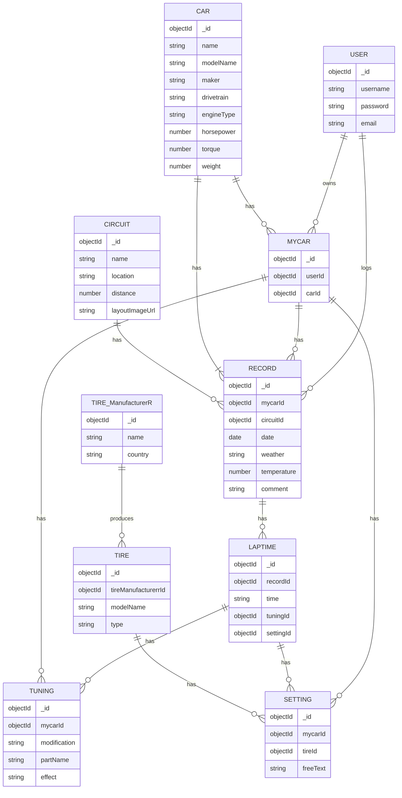

```mermaid
erDiagram
  USER ||--o{ MYCAR : owns
  USER ||--o{ RECORD : logs
  CAR ||--o{ MYCAR : has
  MYCAR ||--o{ RECORD : has
  CAR ||--|{ RECORD : has
  CIRCUIT ||--o{ RECORD : has
  RECORD ||--o{ LAPTIME : has
  LAPTIME ||--o{ TUNING : has
  MYCAR ||--o{ TUNING : has
  MYCAR ||--o{ SETTING : has
  LAPTIME ||--o{ SETTING : has
  TIRE_ManufacturerR ||--o{ TIRE : produces
  TIRE ||--o{ SETTING : has
  USER {
    objectId _id
    string username
    string password
    string email
  }
  CAR {
    objectId _id
    string name
    string modelName
    string maker
    string drivetrain
    string engineType
    number horsepower
    number torque
    number weight
  }
  CIRCUIT {
    objectId _id
    string name
    string location
    number distance
    string layoutImageUrl
  }
  RECORD {
    objectId _id
    objectId mycarId
    objectId circuitId
    date date
    string weather
    number temperature
    string comment
  }
  MYCAR {
    objectId _id
    objectId userId
    objectId carId
  }
  LAPTIME {
    objectId _id
    objectId recordId
    string time
    objectId tuningId
    objectId settingId
  }
  TUNING {
    objectId _id
    objectId mycarId
    string modification
    string partName
    string effect
  }
  SETTING {
    objectId _id
    objectId mycarId
    objectId tireId
    string freeText
  }
  TIRE_ManufacturerR {
    objectId _id
    string name
    string country
  }
  TIRE {
    objectId _id
    objectId tireManufacturerrId
    string modelName
    string type
  }

```
